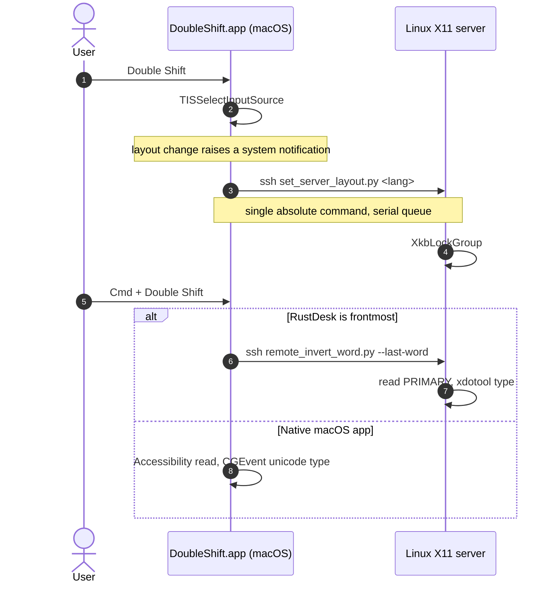

# Doubleshifter 🚀 (v5.0.0)

🌐 **Language / Язык:** [English](README.md) | [Русский](README.ru.md)

[](https://github.com/Arkadius0292/Doubleshifter)
[](LICENSE)
[-blue.svg)]()

**Doubleshifter** switches the keyboard layout (`RU ↔ EN`) on a double `Shift` tap and fixes text typed in the wrong layout (`Ghbdtn` ➔ `Привет`). It keeps macOS and a remote Linux X11 session in sync, so the layout you see on the Mac is the layout the server actually types in.

---

## 🔥 What's new in v5.0.0

This release is almost entirely about **race conditions**. Layout switching and inversion used to work roughly every other time, and the cause was never a single bug — it was several independent races over shared resources: the double-`Shift` event, the server's layout, and the clipboard.

- **One process, enforced.** An `flock` at startup rejects a second instance. Previously launchd and a manual `nohup` both held one, each caught the same double `Shift`, and the layout toggled twice — which looks exactly like nothing happening.
- **One sync channel instead of two.** Every double `Shift` used to send *both* an absolute `set` (from the layout observer) and a relative `toggle`, in two independent `ssh` processes with no ordering guarantee. Whichever arrived last won. Now only the absolute `set` is sent, through a serial queue, waiting for completion. Absolute state is self-healing; a lost or duplicated `toggle` is not.
- **Correct language detection.** Layout language now comes from `kTISPropertyInputSourceLanguages`. The old substring test for `"us"` matched `com.apple.keylayout.r`**`us`**`sianwin`, so asking for English could select Russian.
- **The clipboard is no longer involved.** Inversion reads the selection through the Accessibility API and types the result with `CGEvent.keyboardSetUnicodeString`. On the server it reads `PRIMARY` and types via `xdotool type`.
- **Numbers survive.** `10.10.10.1` stays `10.10.10.1` — dots and commas between digits are not converted. Added `/` ➔ `.` and `?` ➔ `,`, so `Ghbdtn? vbh!` now yields `Привет, мир!` instead of `Привет? мир!`.

---

## ⌨️ Shortcuts

On the Mac:

| Action | Keys |
|---|---|
| Switch layout | double `Shift` |
| Invert selection or last word | `Cmd` + double `Shift` |

Inside a RustDesk session, macOS and RustDesk intercept several combinations before they reach Linux, so the remote side has its own set:

| Action | Keys on the Mac | Arrives on Linux as |
|---|---|---|
| Switch layout | `Cmd+⌥+Space` or `⌥+G` | `Ctrl+Alt+Space` / `Alt+G` |
| Invert last word | `⌥+Q` | `Alt+Q` |
| Invert mouse selection | `⌥+W` | `Alt+W` |

`Cmd+Space` and `Ctrl+Space` never arrive — Spotlight and the input-source switcher consume them on the Mac. With RustDesk's `allow_swap_key`, `Cmd` reaches Linux as `Ctrl`.

---

## 🛠 Architecture



The server never receives a relative `toggle` for layout — only an absolute language. That is what makes the two sides converge instead of drifting apart.

---

## 📦 Installation

**macOS:**

```bash
git clone https://github.com/Arkadius0292/Doubleshifter.git
cd Doubleshifter
./scripts/install.sh
```

Then grant **System Settings → Privacy & Security → Accessibility → DoubleShift**. Without it the key tap never starts and inversion cannot read the selection. The process picks the permission up on its own — watch `/tmp/double_shift_switcher.log`.

To rebuild an existing installation use `./rebuild.sh`. Do not use `pkill` + `nohup`: the LaunchAgent has `KeepAlive`, so killing it spawns a replacement and the manual start becomes a second instance.

**Linux server** (run there, needs `xdotool`, `xclip`, `x11-utils`):

```bash
./scripts/install_server.sh
```

---

## ⚠️ One binding, one owner

The single most expensive lesson in this project: a shortcut must have exactly one handler. On the server, `Alt+1` was once bound in openbox, in xbindkeys **and** in the keyboard daemon — one press launched the session switcher three times. `Alt+Space` was worse: openbox grabbed it via `XGrabKey`, so nobody else ever saw it.

After changing anything, verify that a keystroke does what you expect **once**. `server/xbindkeysrc` shows the split that works.

---

## 📄 License

Distributed under the [MIT License](LICENSE).
