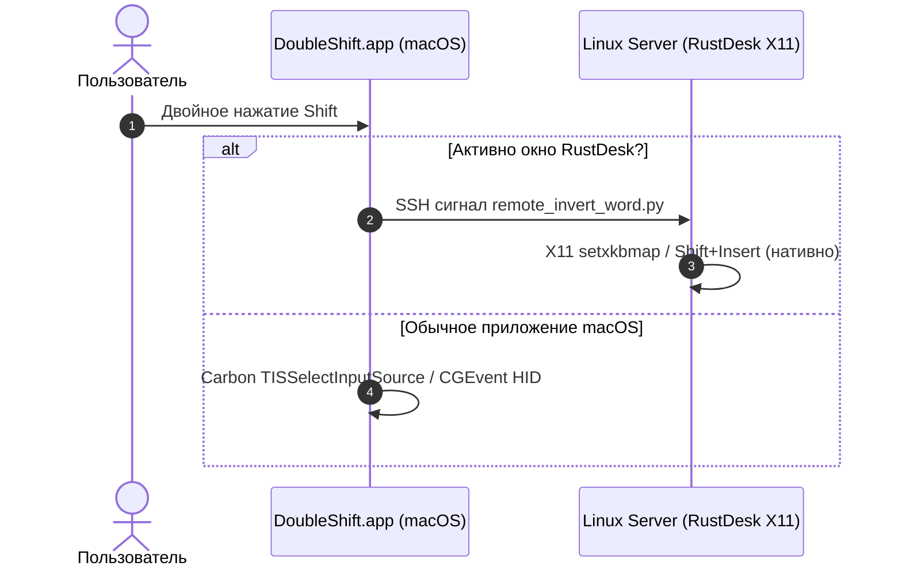

# Doubleshifter 🚀 (v4.0.0)

[](https://github.com/Arkadius0292/Doubleshifter)
[](LICENSE)
[-blue.svg)]()

**Doubleshifter** — ультрабыстрая утилита для macOS и удалённых Linux-сессий (RustDesk), автоматизирующая смену раскладки клавиатуры (RU ↔ EN) по двойному нажатию `Shift`, а также умную инверсию раскладки текста при зажатой клавише `Cmd`.

---

## 🔥 Возможности v4.0.0

- **⚡️ 100% Чистая смена языка**: Двойной клик `Shift` переключает системную раскладку за 0.01 мс без паразитной печати букв `c` и без вмешательства в буфер обмена.
- **🔄 Умная инверсия (`Cmd` + Двойной `Shift`)**:
  - **Если текст выделен мышкой**: Инвертирует именно выделенный фрагмент (`Ghbdtn` ➔ `Привет`).
  - **Если текст не выделен**: Автоматически выделяет последнее набранное слово перед курсором и инвертирует его.
- **🧹 Нулевое дублирование (Pre-clearing BackSpace)**: Перед вставкой инвертированного текста система выполняет мгновенное стирание выделенного фрагмента, гарантируя отсутствие дубликатов вставок.
- **🖥 Гибридный движок RustDesk (Linux X11)**: При работе внутри RustDesk утилита выполняет нативную обработку на сервере Linux через SSH с использованием `xclip` и `xdotool`.
- **⚡️ Native CGEvent Engine**: Все ключевые сочетания на macOS выполняются через микросекундные системные события ядра `CGEvent`.

---

## 🛠 Архитектура



---

## 📦 Установка на macOS

```bash
git clone https://github.com/Arkadius0292/Doubleshifter.git
cd Doubleshifter
chmod +x scripts/install.sh
./scripts/install.sh
```

---

## 📄 Лицензия

Распространяется под лицензией [MIT](LICENSE).
