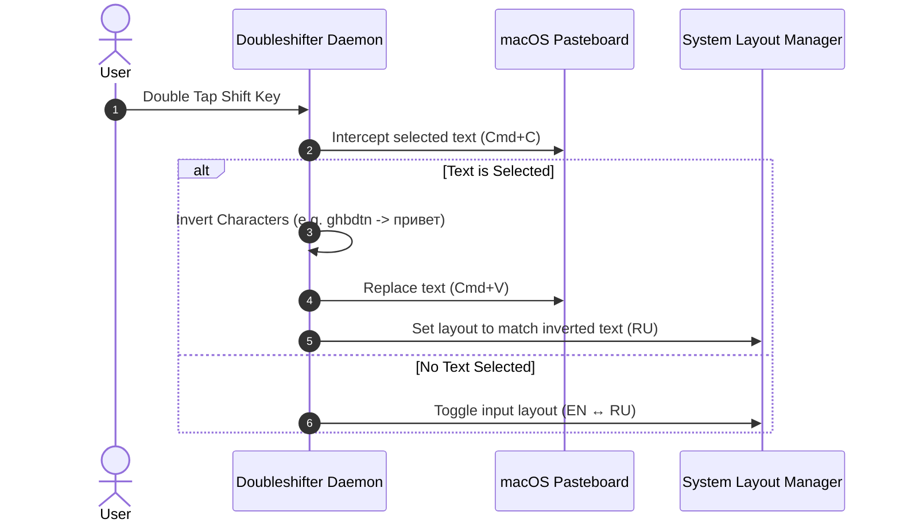

# ⚡️ Doubleshifter for macOS


> **Doubleshifter** is an ultra-fast, lightweight, native macOS utility that replaces buggy CapsLock layout switching with an instant **Double-Tap Shift** gesture and features **Smart Word Inversion** with automatic input language fixation.

---

## ✨ Features

- 🚀 **Instant Double-Tap Shift**: Tap `Shift` twice (<350ms) to toggle input layout (`EN ↔ RU`) with zero latency. No firmware delays or CapsLock latches.
- 🔄 **Smart Word Inversion**: Highlight any mistyped text (e.g. `ghbdtn` or `руддщ`) and tap `Shift` twice to automatically convert it (`ghbdtn` ➔ `привет` / `руддщ` ➔ `hello`).
- 🌐 **Auto Language Fixation**: Automatically detects the inverted text language and sets your active system keyboard layout accordingly.
- 🖥 **Remote Desktop & Terminal Friendly**: Fully compatible with RustDesk, Xpra, VSCode, Xcode, iTerm2, and Web Browsers.
- 🔒 **Privacy-First & Zero Footprint**: 100% native Swift code, ~0% CPU usage, zero network calls, zero telemetry.

---

## 🛠 How It Works



---

## 📦 Installation

### Option 1: 1-Click Automated Install Script

Run the following command in Terminal:

```bash
curl -fsSL https://raw.githubusercontent.com/Arkadius0292/Doubleshifter/main/scripts/install.sh | bash
```

### Option 2: Build from Source

```bash
# 1. Clone repository
git clone https://github.com/Arkadius0292/Doubleshifter.git
cd Doubleshifter

# 2. Build and sign native macOS app bundle
mkdir -p /Applications/DoubleShift.app/Contents/MacOS
swiftc src/DoubleShiftSwitcher.swift -o /Applications/DoubleShift.app/Contents/MacOS/DoubleShift
codesign -f -s - /Applications/DoubleShift.app/Contents/MacOS/DoubleShift

# 3. Install LaunchAgent service for 24/7 background run
cp launchd/com.user.doubleshift.plist ~/Library/LaunchAgents/
launchctl load -w ~/Library/LaunchAgents/com.user.doubleshift.plist
```

---

## ⚙️ Permissions Setup

Upon first run, macOS requires **Accessibility Permissions**:

1. Open **System Settings ➔ Privacy & Security ➔ Accessibility**.
2. Click **`+`** and add `/Applications/DoubleShift.app`.
3. Ensure the toggle switch is enabled **ON**.

---

## 📄 License

This project is licensed under the [MIT License](LICENSE) — free for personal and commercial use.

Created with ❤️ by **Aliaksandr Kulesh ([@Arkadius0292](https://github.com/Arkadius0292))**.
