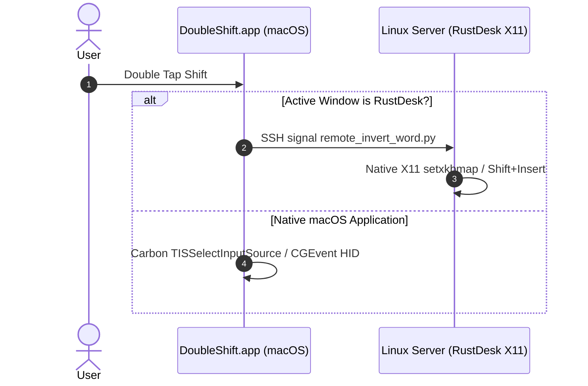

# Doubleshifter 🚀 (v4.0.0)

🌐 **Language / Язык:** [English](README.md) | [Русский](README.ru.md)

[](https://github.com/Arkadius0292/Doubleshifter)
[](LICENSE)
[-blue.svg)]()

**Doubleshifter** is an ultra-fast, lightweight keyboard utility for macOS and remote Linux sessions (RustDesk) that automates keyboard layout switching (`RU ↔ EN`) on double `Shift` tap, and provides smart layout text inversion when holding `Cmd`.

---

## 🔥 Features (v4.0.0)

- **⚡️ 100% Clean Layout Toggle**: Double-tapping `Shift` switches the system keyboard layout in 0.01ms with zero accidental character typing or clipboard interference.
- **🔄 Smart Text Inversion (`Cmd` + Double `Shift`)**:
  - **Mouse Selection**: Inverts selected text (`Ghbdtn` ➔ `Привет`).
  - **Auto Word Selection**: If no text is selected, automatically selects and inverts the last typed word before the cursor.
- **🧹 Zero Dual-Paste (Pre-clearing BackSpace)**: Issues an immediate `BackSpace` command before pasting inverted text to guarantee zero duplicate text insertions.
- **🖥 Hybrid RustDesk Engine (Linux X11)**: Operates seamlessly inside RustDesk remote sessions by delegating processing to a server-side Python X11 engine over low-latency SSH (`remote_invert_word.py`).
- **⚡️ Native CGEvent Engine**: High-frequency macOS shortcuts execute natively via microsecond-level `CGEvent` kernel input events.

---

## 🛠 Architecture



---

## 📦 Installation on macOS

```bash
git clone https://github.com/Arkadius0292/Doubleshifter.git
cd Doubleshifter
chmod +x scripts/install.sh
./scripts/install.sh
```

---

## 📄 License

Distributed under the [MIT License](LICENSE).
