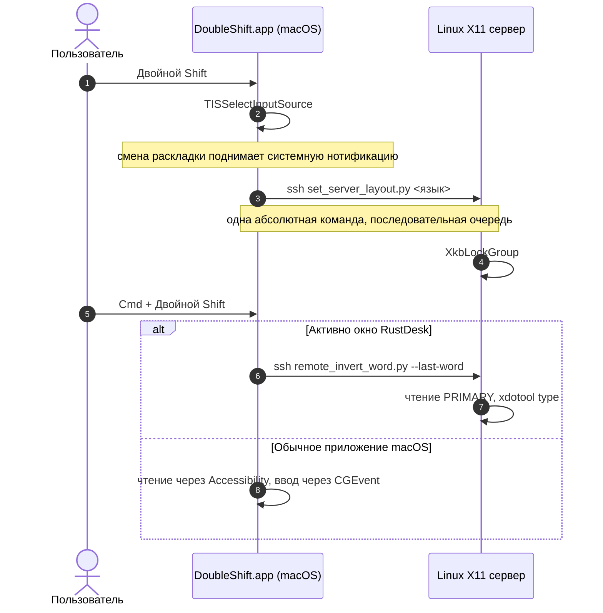

# Doubleshifter 🚀 (v5.0.0)

🌐 **Язык / Language:** [Русский](README.ru.md) | [English](README.md)

[](https://github.com/Arkadius0292/Doubleshifter)
[](LICENSE)
[-blue.svg)]()

**Doubleshifter** переключает раскладку (`RU ↔ EN`) по двойному нажатию `Shift` и исправляет текст, набранный не в той раскладке (`Ghbdtn` ➔ `Привет`). Держит macOS и удалённую Linux-сессию X11 в одном языке, чтобы раскладка, которую вы видите на Маке, совпадала с той, в которой печатает сервер.

---

## 🔥 Что изменилось в v5.0.0

Этот релиз почти целиком про **гонки**. Переключение раскладки и инверсия срабатывали примерно через раз, и причиной был не один баг, а несколько независимых гонок за общие ресурсы: событие двойного `Shift`, раскладку сервера и буфер обмена.

- **Один процесс, гарантированно.** `flock` при старте отсекает второй экземпляр. Раньше launchd и ручной `nohup` держали по одному, оба ловили один и тот же двойной `Shift`, и раскладка переключалась дважды — что выглядит ровно как «не сработало».
- **Один канал синхронизации вместо двух.** На каждый двойной `Shift` уходили *обе* команды — абсолютный `set` от наблюдателя раскладки и относительный `toggle` — в двух независимых процессах `ssh` без гарантии порядка. Побеждала та, что пришла последней. Теперь только абсолютный `set`, через последовательную очередь, с ожиданием завершения. Абсолютное состояние самовосстанавливается, относительное — накапливает ошибку.
- **Правильное определение языка.** Язык раскладки берётся из `kTISPropertyInputSourceLanguages`. Прежняя проверка подстроки `"us"` ложно срабатывала на `com.apple.keylayout.r`**`us`**`sianwin`, и запрос английского мог выбрать русскую раскладку.
- **Буфер обмена больше не участвует.** Инверсия читает выделение через Accessibility API и набирает результат через `CGEvent.keyboardSetUnicodeString`. На сервере читает `PRIMARY` и печатает через `xdotool type`.
- **Цифры не страдают.** `10.10.10.1` остаётся `10.10.10.1` — точки и запятые между цифрами не конвертируются. Добавлены пары `/` ➔ `.` и `?` ➔ `,`, поэтому `Ghbdtn? vbh!` теперь даёт `Привет, мир!`, а не `Привет? мир!`.

---

## ⌨️ Сочетания клавиш

На Маке:

| Действие | Клавиши |
|---|---|
| Переключить раскладку | двойной `Shift` |
| Инвертировать выделение или последнее слово | `Cmd` + двойной `Shift` |

Внутри RustDesk часть сочетаний перехватывают macOS и сам RustDesk, до Linux они не доходят — поэтому у удалённой стороны свой набор:

| Действие | Клавиши на Маке | Приходит в Linux как |
|---|---|---|
| Переключить раскладку | `Cmd+⌥+Space` или `⌥+G` | `Ctrl+Alt+Space` / `Alt+G` |
| Инвертировать последнее слово | `⌥+Q` | `Alt+Q` |
| Инвертировать выделенное мышью | `⌥+W` | `Alt+W` |

`Cmd+Space` и `Ctrl+Space` не доходят никогда — их забирают Spotlight и переключатель источника ввода на самом Маке. При включённом в RustDesk `allow_swap_key` клавиша `Cmd` приходит в Linux как `Ctrl`.

---

## 🛠 Архитектура



Сервер никогда не получает относительный `toggle` раскладки — только абсолютный язык. Именно поэтому стороны сходятся, а не расходятся.

---

## 📦 Установка

**macOS:**

```bash
git clone https://github.com/Arkadius0292/Doubleshifter.git
cd Doubleshifter
./scripts/install.sh
```

Затем выдайте права: **Системные настройки → Конфиденциальность и безопасность → Универсальный доступ → DoubleShift**. Без них перехват клавиш не запускается, а инверсия не может прочитать выделенный текст. Процесс подхватит права сам — смотрите `/tmp/double_shift_switcher.log`.

Для пересборки уже установленной копии — `./rebuild.sh`. Не используйте `pkill` + `nohup`: у LaunchAgent стоит `KeepAlive`, поэтому убитый процесс тут же поднимается заново, а ручной запуск становится вторым экземпляром.

**Linux-сервер** (запускать на нём, нужны `xdotool`, `xclip`, `x11-utils`):

```bash
./scripts/install_server.sh
```

---

## ⚠️ Одно сочетание — один владелец

Самый дорогой урок этого проекта: у горячей клавиши должен быть ровно один обработчик. На сервере `Alt+1` одновременно висел в openbox, в xbindkeys **и** в демоне клавиатуры — одно нажатие запускало переключатель сессий трижды. С `Alt+Space` было хуже: openbox забирал его через `XGrabKey`, и до остальных он не доходил вовсе.

После любых правок проверяйте, что нажатие делает нужное действие **один раз**. Рабочее разделение показано в `server/xbindkeysrc`.

---

## 📄 Лицензия

Распространяется под лицензией [MIT](LICENSE).
